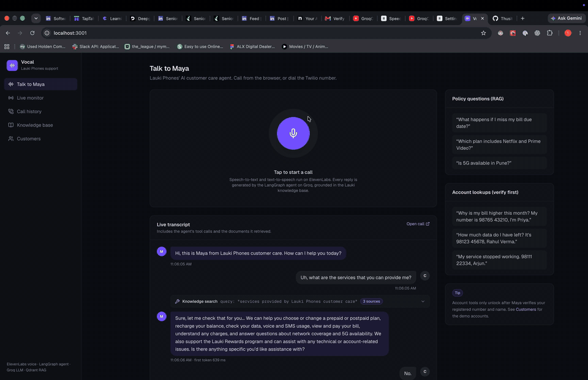
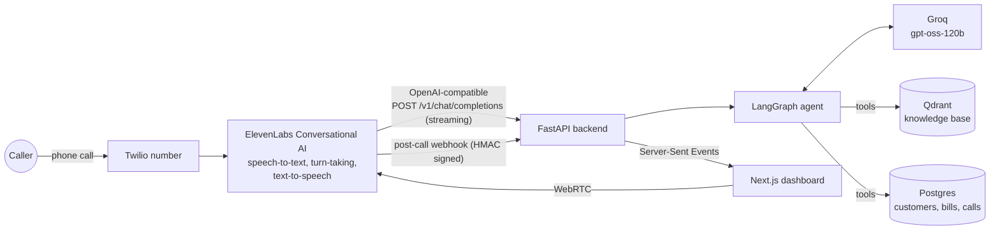
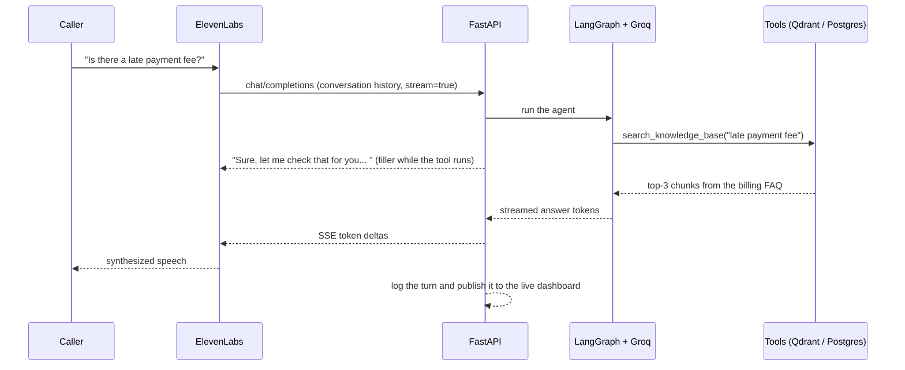
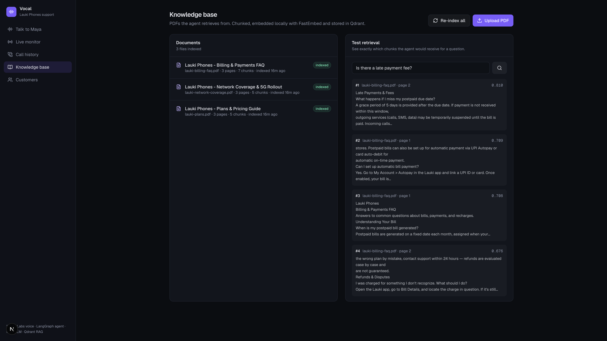

# Vocal

An AI voice agent that answers customer-service phone calls for **Lauki Phones**, a fictional
Indian mobile network. Callers speak naturally; Vocal transcribes them, works out what they need,
looks up policy documents or their account, and talks back, typically starting to answer in
well under a second.

It can answer questions about plans, billing, recharges, refunds and 5G coverage from a PDF
knowledge base (RAG), and, once the caller is verified, read out their own bill, usage and
account status from a Postgres database. A Next.js dashboard lets you talk to the agent from the
browser, watch calls live with every tool call and retrieved document, and manage the knowledge
base.



Maya lists the four plans, then explains Priya Sharma's higher bill after the caller gives
her number and name. The live transcript shows the tool calls underneath.

## How it works



ElevenLabs handles the audio: speech-to-text, detecting when the caller has finished speaking,
interruptions and text-to-speech. Every reply, though, is generated by this repo. The ElevenLabs
agent is configured with a **Custom LLM** that points at the backend's OpenAI-compatible
`/v1/chat/completions` endpoint, so the conversation logic, tools and prompts all live in
LangGraph and can be tested like normal code.

One conversational turn:



### Design choices worth a look

- **Streaming first.** Tokens are forwarded to ElevenLabs as Groq produces them, so text-to-speech
  starts on the first words. When the agent calls a tool, a short filler phrase ("One moment
  while I look that up...") is streamed immediately so the caller never hears dead air. First-token
  latency is recorded for every turn and shown in the dashboard.
- **Verification before account data.** Account tools refuse to return anything until
  `verify_customer` has matched the caller's registered number and name. On phone calls, a
  caller ID that matches a customer verifies them automatically.
- **Grounded answers.** Policy questions must go through `search_knowledge_base`; the system
  prompt forbids guessing prices or policy. PDFs are chunked with a document-title header on each
  chunk, embedded locally with FastEmbed (`bge-small-en-v1.5`, no API key needed), and stored in
  Qdrant. Retrieved sources are attached to each turn, so you can see what the agent read.
- **Voice-shaped prompting.** Replies are short, contain no markdown, and read out amounts
  and phone numbers the way a person would say them.
- **Ending calls.** When the caller says goodbye, the agent calls ElevenLabs' built-in `end_call`
  tool. The backend forwards it as an OpenAI `tool_calls` delta so ElevenLabs hangs up after the
  farewell.
- **Graceful failure.** If the LLM errors mid-call, the caller hears an apology and a request to
  repeat, instead of silence. If the caller interrupts, the partial turn is logged as
  interrupted.
- **Observability.** Every call, turn, tool call (with arguments and retrieved sources) and latency
  is stored in Postgres and pushed to the dashboard over Server-Sent Events. The signed post-call
  webhook adds the ElevenLabs transcript, summary and success evaluation.
- **Testable without API keys.** The test suite drives the real LangGraph graph, API and
  databases with a scripted fake chat model, so it runs offline and deterministically.

## Tech stack

| Layer | Technology |
| --- | --- |
| Voice (STT, TTS, turn-taking) | ElevenLabs Conversational AI, `eleven_flash_v2` |
| Telephony | Twilio number imported into ElevenLabs |
| Agent | LangGraph 1.x, LangChain tools |
| LLM | Groq (`openai/gpt-oss-120b` by default, any Groq model works) |
| RAG | pypdf, LangChain text splitters, FastEmbed, Qdrant |
| API | FastAPI, SSE (sse-starlette), async SQLModel / SQLAlchemy |
| Database | Postgres 16, Alembic migrations |
| Dashboard | Next.js 16, React 19, Tailwind CSS v4, `@elevenlabs/react` |
| Tooling | uv, Ruff, pytest, Docker Compose |

## Repository layout

```
backend/
  app/
    agent/        LangGraph graph, tools, system prompt, turn runner (streaming + logging)
    api/          custom LLM endpoint, ElevenLabs webhook, dashboard, knowledge, voice session
    db/           SQLModel models, session, demo seed data
    rag/          PDF ingestion, embeddings, Qdrant store
    services/     calls/turns persistence, live event bus, phone number helpers
  migrations/     Alembic
  scripts/        ElevenLabs agent setup, terminal chat
  tests/          pytest suite (scripted LLM, real Postgres + Qdrant)
frontend/         Next.js dashboard
data/knowledge/   Lauki Phones PDFs (plans, billing FAQ, network coverage)
```

## Getting started

### Prerequisites

- Docker (for Postgres and Qdrant)
- [uv](https://docs.astral.sh/uv/) and Node.js 20+
- [ngrok](https://ngrok.com/) (or any HTTPS tunnel) so ElevenLabs can reach your local backend

API keys:

| Key | Where to get it | Needed for |
| --- | --- | --- |
| `GROQ_API_KEY` | [console.groq.com/keys](https://console.groq.com/keys) | The agent's LLM |
| `ELEVENLABS_API_KEY` | [ElevenLabs API keys](https://elevenlabs.io/app/settings/api-keys) | Voice, agent setup |
| `CUSTOM_LLM_API_KEY` | `openssl rand -hex 32` | Authenticating ElevenLabs to your backend |
| `ELEVENLABS_WEBHOOK_SECRET` | ElevenLabs post-call webhook settings | Verifying webhooks |
| `TWILIO_*` (optional) | [console.twilio.com](https://console.twilio.com) | A real phone number |

> **Groq free tier:** it allows 8,000 tokens per minute per model, and one voice turn uses about
> 2,500-3,000 tokens. That is enough for `make chat` and short tests, but a natural conversation
> gets throttled after a few turns (replies stall for 10+ seconds). Use Groq's pay-as-you-go
> Developer tier for real calls; a few minutes of conversation costs a fraction of a cent to a
> couple of cents.

### 1. Install and start the local stack

```bash
make setup      # creates .env, installs deps, starts Postgres + Qdrant, migrates, seeds, indexes the PDFs
```

Fill in `GROQ_API_KEY` and `CUSTOM_LLM_API_KEY` in `.env`, then:

```bash
make dev        # backend on http://localhost:8000, dashboard on http://localhost:3000
```

You can talk to the agent in text right away, without any voice setup:

```bash
make chat
make chat ARGS="--caller +919876543210"   # simulate a phone call from Priya Sharma
```

### 2. Connect ElevenLabs

```bash
make tunnel     # in another terminal; copy the https URL into PUBLIC_BACKEND_URL in .env
```

Add `ELEVENLABS_API_KEY` to `.env`, then create the agent:

```bash
make elevenlabs-agent
```

This stores `CUSTOM_LLM_API_KEY` as an ElevenLabs workspace secret and creates the agent with
the custom LLM, voice, greeting and `end_call` tool. It then writes `ELEVENLABS_AGENT_ID` to
`.env`. Run it again whenever your tunnel URL changes; it updates the existing agent.

Finally, in **ElevenLabs > Agents > Settings > Webhooks**, add a post-call webhook pointing at
`https://<your-tunnel>/webhooks/elevenlabs/post-call` and put its secret in
`ELEVENLABS_WEBHOOK_SECRET`. Restart the backend, open the dashboard and press the mic button.

### 3. Optional: a real phone number

Put your Twilio credentials and number in `.env` and run:

```bash
make elevenlabs-agent ARGS=--twilio
```

The number is imported into ElevenLabs and assigned to the agent, so inbound calls go straight to
Maya. Set `DEMO_CUSTOMER_PHONE` to your own number and re-run `make seed`. Calls from your phone
are then recognised as the demo customer Priya Sharma.

### Run everything in Docker

```bash
make docker         # builds and starts Postgres, Qdrant, backend (:8000) and dashboard (:3000)
make docker-init    # in another terminal: seed demo data and index the knowledge base
```

## Things to try

Policy questions (answered from the PDFs):

- "What happens if I miss my bill due date?"
- "Which plan includes Netflix and Prime Video?"
- "Is 5G available in Pune?"

Account questions (Maya asks for the registered number and name first):

| Customer | Number | Scenario |
| --- | --- | --- |
| Priya Sharma | 98765 43210 | Bill higher than usual because of a roaming pack |
| Rahul Verma | 98123 45678 | Autopay customer, plenty of data left |
| Ananya Iyer | 99001 12233 | Prepaid validity ending in three days, data nearly used up |
| Arjun Mehta | 98111 22334 | Service suspended for an overdue bill with a late fee |
| Sneha Reddy | 98222 33445 | Prepaid validity expired |
| Vikram Singh | 98333 44556 | Changed plans mid-cycle, so the bill is prorated |

Try saying "I want to talk to a human" or "goodbye" to hear the escalation and hang-up paths.



## Tests

```bash
make services   # Postgres + Qdrant must be running
make test
make lint
```

The tests create a separate `vocal_test` database and Qdrant collection. They cover retrieval
quality for typical questions, the account tools and verification rules, the streaming endpoint
(fillers, `end_call` forwarding, turn logging), webhook signature checks and the dashboard API.

## API

| Endpoint | Purpose |
| --- | --- |
| `POST /v1/chat/completions` | OpenAI-compatible custom LLM for ElevenLabs (Bearer `CUSTOM_LLM_API_KEY`) |
| `POST /webhooks/elevenlabs/post-call` | Post-call transcript, summary and analysis (HMAC verified) |
| `GET /api/voice/session` | Short-lived WebRTC token for the browser demo |
| `GET /api/calls`, `GET /api/calls/{id}` | Call history, turns, tool calls and transcript |
| `GET /api/stats` | Totals, verification rate, average duration and first-token latency |
| `GET /api/events` | Live call events (Server-Sent Events) |
| `GET /api/customers` | Demo accounts with plan, latest bill and usage |
| `GET/POST /api/knowledge`, `POST /api/knowledge/reindex`, `GET /api/knowledge/search` | Knowledge base management and retrieval testing |
| `GET /health` | Postgres and Qdrant connectivity |

Interactive docs are at `http://localhost:8000/docs`.

## Roadmap

- Deploy to AWS: ECS Fargate for the backend and dashboard, RDS Postgres, Qdrant Cloud or a
  self-hosted Qdrant on ECS, managed with Terraform
- Real human handoff: transfer the call to a Twilio queue instead of promising a callback
- Write actions: plan changes, recharges and appointment booking with confirmation steps
- Redis-backed event bus so the live dashboard works across multiple backend instances
- A LiveKit Agents version of the voice layer (Deepgram STT, Cartesia TTS) for comparison
- Evaluation set of recorded calls with automated scoring of answer accuracy and latency
